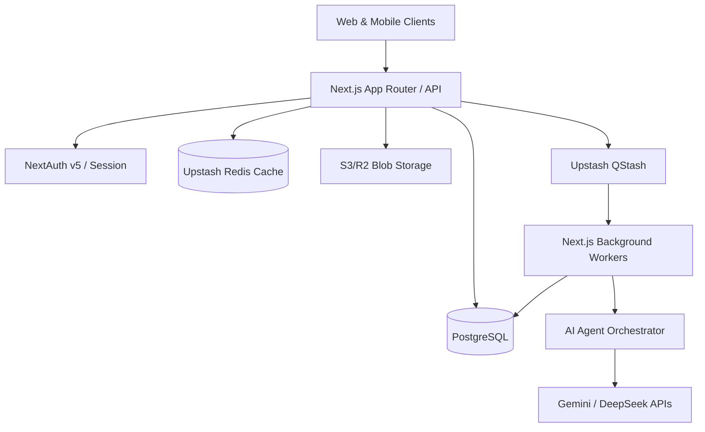
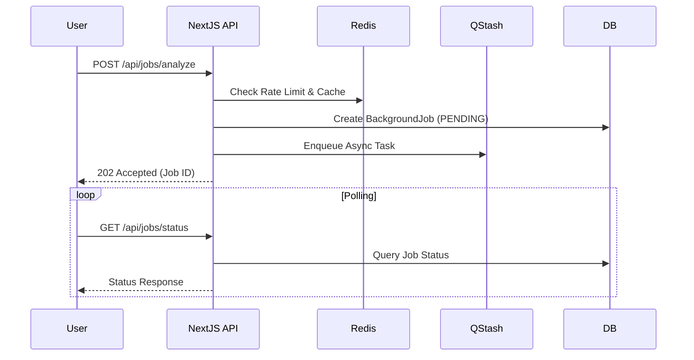
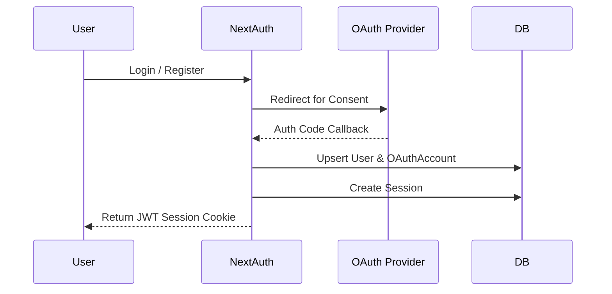
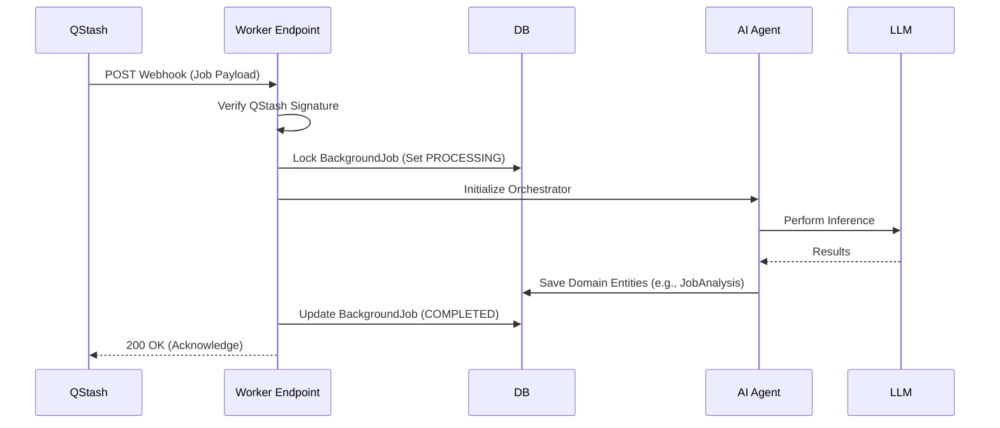
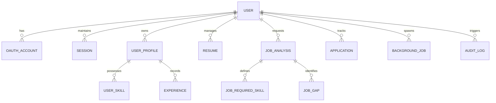

# Architecture Documentation

This document outlines the high-level architecture and system design for the AI Career Copilot. It serves as the primary technical reference for the system's infrastructure, data flows, and security measures.

## 1. System Overview

The AI Career Copilot is designed with a decoupled serverless architecture, ensuring high scalability and resiliency. The core application runs on Next.js 16, utilizing NextAuth.js for session management. Database interactions are handled via Prisma ORM connected to a PostgreSQL database with strict serverless connection pooling to avoid connection storms.

Asynchronous operations, such as AI inferences that exceed standard serverless timeouts, are pushed to Upstash QStash. Redis (Upstash) is used extensively for rate limiting, session caching, and prompt caching, featuring a failover mechanism that degrades gracefully to local memory during network partitions.

### System Architecture Diagram

## 2. User Flow

The user flow is optimized for a seamless onboarding and iterative career development experience:

1. **Onboarding**: Users authenticate via OAuth or Credentials. During onboarding, they can manually enter their data or sync their profiles (e.g., GitHub, LinkedIn) or upload existing resumes.
2. **Analysis**: Users submit target job descriptions for analysis. The system parses the requirements and scores the user's current profile against the job.
3. **Enhancement**: The AI pinpoints skill gaps and provides a tailored roadmap to achieve the target role.
4. **Resume Generation**: Users can generate highly tailored resumes (Factual, Gap-Enhanced, Blueprint) optimized for ATS systems.
5. **Tracking**: Users manage their applications and schedule AI-driven mock interviews.

### Request Flow Diagram

## 3. Authentication Flow

Authentication is managed via NextAuth.js (v5 Beta) utilizing a combination of OAuth providers (Google, GitHub, LinkedIn) and secure credentials.

- **Sessions**: JWT-based sessions are used for fast verification at the edge.
- **Passwords**: Encrypted using robust hashing.
- **Integrations**: OAuth access tokens for third-party integrations (e.g., GitHub, LinkedIn) are encrypted at rest using AES-256-GCM.

### Authentication Flow Diagram

## 4. Background Job Flow

To circumvent the strict timeouts of serverless environments (e.g., Vercel's 10s-60s limits), all heavy tasks (resume parsing, AI generation, deep job analysis) are offloaded to Upstash QStash.

- **Idempotency**: Webhook handlers verify QStash signatures to prevent unauthorized execution. Jobs maintain state (`PENDING`, `PROCESSING`, `COMPLETED`, `FAILED`) in PostgreSQL to guarantee exactly-once processing.
- **Retries**: QStash handles exponential backoff for failed executions.

### Background Job Processing Diagram

## 5. AI Processing Flow

The system employs a multi-agent orchestration pattern rather than a single monolith prompt. This ensures higher accuracy and prevents hallucination.

1. **Profile Agent**: Normalizes user skills, experiences, and uploaded resumes into structured nodes.
2. **Research Agent**: Cross-references job descriptions, engineering blogs, and company requirements.
3. **Gap Analysis Agent**: Compares the user's profile against the ideal persona.
4. **Resume Generation Agent**: Generates tailored resumes strictly adhering to factual boundaries.
5. **ATS Scoring Agent**: Simulates an Applicant Tracking System to score the output.

LLM calls are wrapped with robust retry logic and cached via Redis based on the SHA-256 hash of the input prompt.

## 6. Database Design

The primary data store is PostgreSQL, managed via Prisma. Connection exhaustion is mitigated using a specialized `pg.Pool` configuration for serverless environments (e.g., `max: 2` per container).

Key schema domains include:
- **Core User**: `User`, `UserProfile`, `OAuthAccount`
- **Career Graph**: `Skill`, `Experience`, `Education`, `Project`
- **Intelligence**: `JobAnalysis`, `JobRequiredSkill`, `JobGap`
- **Generations**: `Resume`, `ResumeVersion`
- **Asynchronous**: `BackgroundJob`
- **Observability**: `AuditLog`, `RoleAuditLog`

### Database Relationships Diagram

## 7. RBAC Design (Role-Based Access Control)

Access control is enforced at both the route middleware level and the API data access level.

- **Roles**: 
  - `STUDENT`: Default role with standard platform access.
  - `RECRUITER`: Elevated access to search public profiles and post jobs.
  - `ADMIN`: Global access for system configuration, user management, and viewing system metrics.
- **Ownership Checks**: Every protected API endpoint verifies that the resource being mutated belongs to the authenticated user's `userId`.
- **Role Transitions**: Admin-initiated role changes are strictly logged in the `RoleAuditLog` table.

## 8. Audit Logging Design

To ensure compliance and traceability, the system implements comprehensive audit logging:
- **System Logs**: Changes to critical system parameters or roles are written to `RoleAuditLog`.
- **User Activity**: Sensitive actions (e.g., login, password reset, account deletion, integration syncing) are logged to the `AuditLog` table, capturing IP address, User-Agent, and metadata.
- **API Usage**: AI token consumption and model usage are tracked per user in the `ApiUsage` table to monitor costs and enforce tier limits.

## 9. Security Design

The project has undergone rigorous security hardening:
- **Data at Rest**: Sensitive integration tokens (e.g., GitHub/LinkedIn APIs) are encrypted in PostgreSQL using AES-256-GCM.
- **Secrets Management**: All environment variables and secrets are kept strictly out of version control and managed via secure deployment environments.
- **Rate Limiting**: API endpoints are protected by Upstash Redis rate limiters, preventing abuse, brute-forcing, and DDoS.
- **Input Validation**: Strict Zod schemas are used to parse and sanitize all incoming payloads, preventing SQL/NoSQL injection and XSS attacks.
- **Prompt Injection Defense**: User inputs sent to LLMs are sanitized and sandboxed to prevent jailbreaking.

## 10. Deployment Architecture

The application is built for seamless deployment on modern serverless platforms like Vercel or AWS Amplify.

- **Frontend & API**: Next.js App Router deployed globally on Edge/Serverless functions.
- **Database**: Serverless PostgreSQL (e.g., Supabase / Neon) deployed in a primary region.
- **Cache**: Upstash Redis configured globally.
- **Message Queue**: Upstash QStash delivering webhooks to the Next.js API route workers.
- **Storage**: Cloudflare R2 or AWS S3 for fast, cost-effective blob storage (resumes, avatars).
- **CI/CD**: GitHub Actions runs automated tests (91%+ coverage), linter checks, and Prisma migrations before deploying to staging/production.
